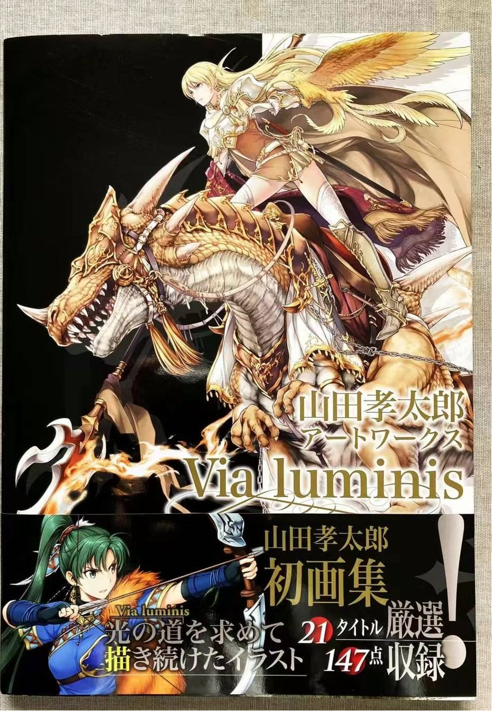
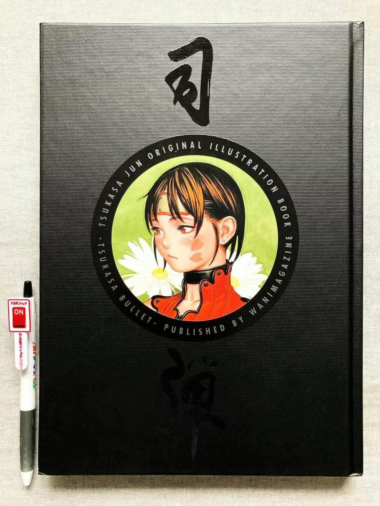
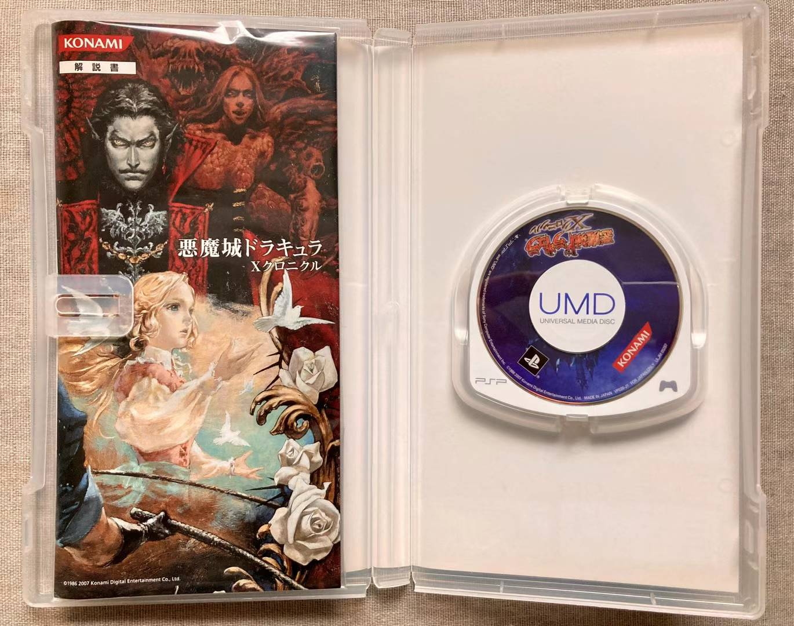

## This is Cheng Da Mo's private blog

 <div></div>
  [《山田孝太郎-初画集》](./images/《山田孝太郎-初画集》)


|      |      |      |
| :----: | :----: | :----: |
| <div></div> [《樱桃小丸子的全部》](./images/《樱桃小丸子的全部》)  | <div></div> [《司弹-宙刃弹插画集》](./images/《司弹-宙刃弹插画集》) | <div></div> [《口袋妖怪黑2白2-O.S.T原声专辑》](./images/《口袋妖怪 黑2白2-O.S.T原声专辑》) | <div></div> [《恶魔城X历代记》UMD](./《恶魔城X历代记》UMD) |  |  |

You can use the [editor on GitHub](https://github.com/chengmo03013106/momomomomo.github.io/edit/master/README.md) to maintain and preview the content for your website in Markdown files.


### Markdown

Markdown is a lightweight and easy-to-use syntax for styling your writing. It includes conventions for

```markdown
Syntax highlighted code block

# Header 1
## Header 2
### Header 3

- Bulleted
- List

1. Numbered
2. List

**Bold** and _Italic_ and `Code` text

[Link](url) and 
```

For more details see [GitHub Flavored Markdown](https://guides.github.com/features/mastering-markdown/).


